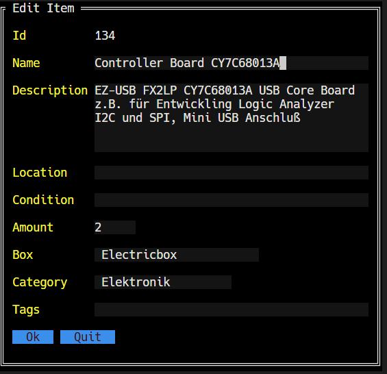
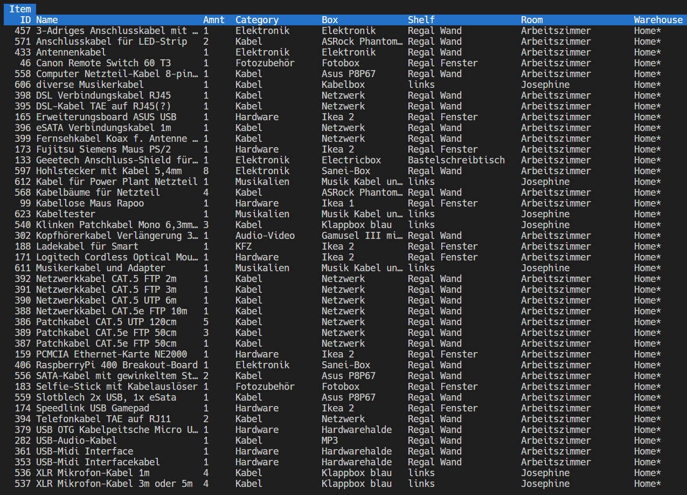
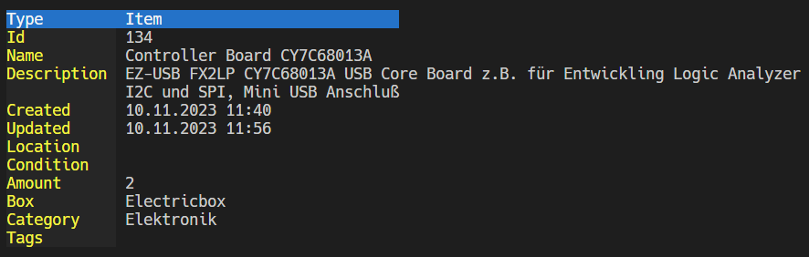

# Lagerator

Terminal-based personal inventory management in Go.

`Lagerator` keeps your stuff organized in a hierarchy:
Warehouse -> Room -> Shelf -> Box -> Item.
Items can also be assigned to categories and tagged.

## Features
- Hierarchical inventory structure (Warehouse/Room/Shelf/Box/Item)
- Categories and tags
- Text search across items
- TUI editor for adding/editing entries

## Installation

### Requirements
- Go 1.21+

### Build from source
```
git clone https://github.com/elsni/lagerator.git
cd Lagerator
make build
```

The binary is created at `bin/lgrt`.

### Install to /usr/local/bin
```
make install
```

## Usage

Run:
```
lgrt <operation> [args]
```

Show version/author:
```
lgrt --version
```

Build with version metadata:
```
make build VERSION=0.1.0
```

### Getting started (empty database)
When starting with an empty database, create the hierarchy top‑down:
1) Create a warehouse
2) Switch to it
3) Add rooms, shelves, boxes
4) Add items to a box (interactive)

Example (minimal workflow):
```bash
# add warehouse "Home"
lgrt aw Home

# switch to warehouse "Home"
lgrt sww Home

# add room "Basement"
lgrt ar Basement

# add a shelf to room (you need quotes only when name contains spaces)
lgrt as "Shelf A" Basement

# add box to shelf
lgrt ab "Box 1" "Shelf A"

# add items to box interactively
lgrt ai "Box 1"
```

Example (with categories + tags):
```bash
# add a category
lgrt ac "Tools"

# category can be selected in add-item dialog
lgrt ai "Box 1"

# add a tag to an item
lgrt at "fragile" <itemId>
```

Examples list and find:
```bash

# list all warehouses
lgrt lw

# list all rooms
lgrt lr

# list all shelves
lgrt ls

# list all boxes
lgrt lb

# list all items
lgrt li

# find all items containing "camera" in name or description
lgrt f camera

# find and sort result list
lgrt fs camera

# list items by tag
lgrt lit broken

# list items by category
lgrt lic clothing
```

Examples reorganizing items
```bash
# move item to different  box
lgrt mi <itemId> <box name|id>

# move box to different shelf
lgrt mb <boxId> <shelf name|id>
```

For the full command list, run `lgrt` without arguments.

## Data storage
Data is stored in:
```bash
~/.lgrt/lgrtdata.json
```

## Screenshots




## Development
Run tests:
```
make test
```

## License
GPL-3.0-or-later
